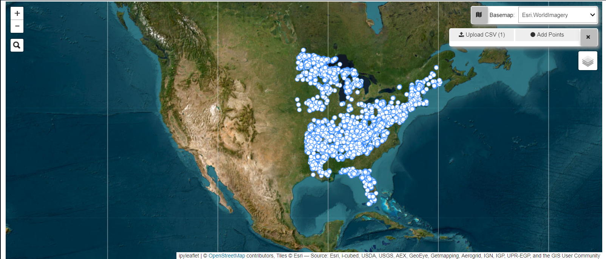

# Summary
`skiba` is a python package deployed on hugging face to allow natural resource professionals such as foresters or wildlife managers to access and retrieve data from Google Earth Engine. This purpose of this package is designed to extract values for a list of provided coordinate points with .

# Introduction

In recent decades, remote sensing has become an invaluable tool in a multitude of fields, due to the versatility of data collected and potential applications`[@chiBigDataRemote2016]`. Such information can be revolutionary in the field of forestry, particularly for inventory and research purposes where large-scale or intense monitoring is difficult or impossible to conduct. However, the uptake of remote sensing in forestry has been slow due to a multitude of reasons, as outlined in `[fassnachtRemoteSensingForestry2024a]`. In addition, several major issues need to be overcome before remote sensing can be fully integrated into standard forestry practices, such as determining forest type, identifying individual trees and species, particularly in mixed-species, uneven aged stands `[@burkhartForestMeasurements2019; @jeronimoApplyingLiDARIndividual2018a]`.

Despite this, foresters and forest biometricians can still utilize publicly available remotely sensed data for information that is not standard in a traditional forest inventory, and forest biometricians can consider various untested environmental and climatological variables to help explain forest dynamics, such as predicting live aboveground carbon (pending publication). Remotely sensed data can still be difficult to access due to various technical barriers as hosting platforms, like Google Earth Engine (GEE), require a proficiency in programming and handling geospatial data retrieve the desired information.

Various tools and packages currently exist to help users streamline this point-oriented acquisition process, such as GEE’s built-in Code Editor. However, these tools still require programming skills and a free, easy-to-use, point-and-click interface that does not require any programming knowledge does not yet exist. Other geographical software programs can query this information, such as ArcGIS and QGIS, but these programs may require a license, and the user must still have a proficient understanding of geospatial analysis to use the software. Even within open source projects for python, querying GEE data can still be a multi-step process that requires various package installations and coding in order to handle the data. A simplified process does not yet exist to help streamline this data acquisition.

This package was developed to complement the USDA Forest Service's Forest Inventory and Analysis's (FIA) long-term national inventory as a part of a project using climate and environmental data from GEE databases. The FIA's inventory has been used frequently by forest biometricians due to the large spatial scale and long temporal scale of this database that can help answer large-scale questions. Due to how time intensive traditional forest inventories are, one plot is taken for every 6,000 acres (`@bechtoldEnhancedForestInventory2015`). Due to the sampling intensity and structure of this inventory design, plots are treated as individual observations in studies. In some instances, smaller grouping levels, such as condition level groups as described in `@yangEstimatingMaximumStand2022` and `@jhaEvaluationRegressionMethods2023`, are treated as individual observations, but smaller grouping levels within the plot may be assumed to have shared characteristics. Examples are elevation, slope, or aspect, which, if measured, are only taken at plot center and not the subplot or any other sub-plot level grouping. Furthermore, only the plot center's coordinates are recorded in the FIA database. Therefore, to complement the FIA's national inventory and its standard use in forest modeling, this package was designed to operate from this plot-level perspective by extracting the values from a GEE dataset for a specified coordinate point (plot center). This approach is appropriate to query data for any grouping level equal to or smaller than the plot level.

This project will be expanded to fit the needs of forest biometricians as they are presented, such as extracting the mean value for a given area and increasing the map's functionality. More geojson layers will be added as well, such as national forests and parks. Furthermore, as this project is hosted on GitHub, users who are comfortable with python can expand and contribute to this package's functionality for their purposes. While this package was developed with forest biometricians in mind, this package can be beneficial to other natural resource professionals who may also desire to utilize the vast range of data available as desired.


# skiba Audience
`skiba` is intended for natural resource professionals who would like to extract Google Earth Engine data for given coordinates, but the use of this package can be useful in other disciplines. This package removes the technological barriers that limit the package’s intended users from being able to utilize remotely sensed data. Users can access the base version of this package through huggingface (…TBD), and users can modify and build upon this package through the package’s GitHub and PyPI repositories. By design, this package is fairly rudimentary, with the goal of expanding the functions of this package to meet the needs of natural resource professionals accordingly. Two additional functions are currently being developed: a polygon buffering tool that will allow users to preserve any confidential coordinates they have and function that will extract temporal data, such as daily or monthly averages, for temporal analyses.

This package has been used in existing research projects to query data and will be presented at various local and national conferences to promote its use to a broader range of users, as well as to the USFS Southern Research Station's FIA group in Knoxville, TN as an alternative to outsourcing their remote sensing needs to another office.

# skiba Functionality
The `skiba` package is built upon `@ipyleaflet` and `@geemap`, while also utilizing `@pandas` and `@geopandas` for data handling and `@ee` for source data. `skiba` is broken into two key modules:
-	**`map_details`:** module for displaying an interactive map with uploaded coordinates plotted. Users may customize the map as allowed. This module uses `@ipyleaflet`, `@ipywidgets`, and `@geemap`. A walkthrough of this map feature can be found in `map_details_demo.ipynb`
-	**`data_process`:** module for processing GEE data and returning the desired information for the user-provided coordinates. This module utilizes `@geemap`, `@pandas`, `@geopandas`, and `@ipywidgets`. A full demonstration of this module can be found in `data_process_demo.ipynb`.


# skiba User Guide
- **Step 1:**   The User uploads a csv or xlsx file that must at least the following three columns: a plot identifier (e.g. plot #), latitude (in dd.), longitude (in dd.).
  - Example csv file format:
    ```python
    "plot_ID","LAT","LON"
    "37_39_63",35.138399,-84.180002
    ```
    *Note: latitude and longitude column names must match example format*
- **Step 2:**   A map will appear with provided coordinates plotted.
     *Example of `map_details` module with sample dataset.*
- **Step 3:**	User selects a Google Earth Engine dataset from the dropdown.
  - **Step 3.b (Optional):**   User selects desired time frame.
- **Step 4:**	Package returns a csv file with point values from all bands of provided coordinates within selected GEE dataset. The csv file will be automatically saved in the user's local `~/Downloads` folder.
- *Note:* the full website is still pending, but temporary demos can be found as stated in the **functionality** section. This package may be temporarily used through the package's Colab pages until the official website is built.


# Acknowledgements
The author would like to thank the developers of geemap, ipyleafet, and ipywidgets, which were heavily utilized to efficiently create a map and query the desired data. The author would also like to thank the the USDA's U.S. Forest Service Forest Inventory and Analysis program for their financial support.

# References
